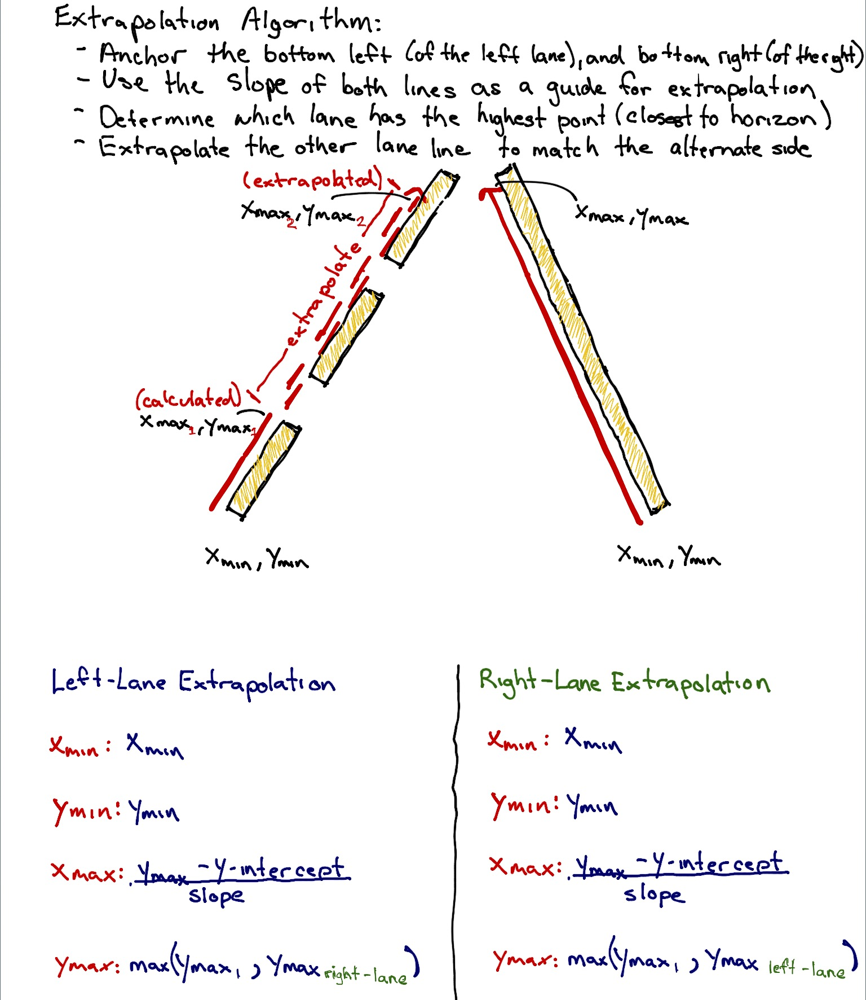

# **Uadcity Self Driving Car Nanodegree Program: Finding Lane Lines on the Road** 

Lane detection is one of the most important aspects of autonomous navigation. It is the first step in enabling the vehicle to visualize and then make sense of its environment.

The goal of this project was to create a pipeline that finds lane lines on the road.

[//]: # (Image References)

### 1. The Approach

1. The original image is first converted to ~~grayscale~~ HSV colorspace.

**Why, you ask ?**

Whilst the RGB colorspace is more conventional and intuitive in terms of describing colors, it isn't the best option around when the illumination conditions change.

[HSV](https://msdn.microsoft.com/en-us/library/windows/desktop/dd372106(v=vs.85).aspx) colorspace is good at this in a way that all the color information is encoded in single channel H. This way, the information in this channel doesnt change with varying lighting conditions.

[image1]: ./screenshots/Selection_023.png "Conversion to HSV color space"  
![alt text][image1]

2. The ~~grayed out~~ HSV converted image is then smoothed out using the opencv library's gaussianBlur function.

This helps remove any noise from the image. It's an important pre-processing step for canny edge detection.

3. Masks for yellow and white colors are applied on the HSV image to extract lane lines from the image.

[image2]: ./screenshots/Selection_024.png "Yellow and White masking"  
![alt text][image2]

**Why ?**

Even after conversion to HSV color space and application of Gaussian Blur, there can still be noise in the image that can interfere with the identification of lane lines. An effective way to get past this is to look for specific colors in the image, filtering out the noise in the image.
In our case, we know the lane lines are primarily yellow and white in color, we can make use of this information to apply yellow and white masks on our HSV image and try to remove everything else, other than the lane lines.

4. Then the edges in the image are detected by passing the smoothed out gray image into the opencv's canny function. 

[image3]: ./screenshots/Selection_025.png "Canny Edge Detection"  
![alt text][image3]

5. After the edges have been detected, only that portion of the image needs to be considered for further processing that has road lane lines in view.

[image4]: ./screenshots/polygon.png "Polygon shape to take the portion from the image having lane lines"
![alt text][image4] 

[image5]: ./screenshots/Selection_026.png "Region of interest" 
![alt text][image5] 

6. Now that the image only has the canny edges for the lane lines portion and the rest of it blacked out, hough lines are drawn from those detected edges.

[image6]: ./screenshots/Selection_027.png "Hough lines drawn for the lane lines"
![alt text][image6]

Drawing lines from the detected edges is one of the most important aspects for this project. For two single lines to be drawn over the edges, one for each line of the lane (left and right), the draw_line() function is modified in the following way:

  ### DRAW-LINE ALGORITHM

  
 a. To extrapolate the lines returned from the hough lines and create two single lines, two endpoints (x_min, y_min, x_max. y_max) for the two lane lines and their corresponding  slope values (positive_slope, negative_slope) and intercepts (positive_intercept, negative_intercept) are needed. This forms the problem statement for the algorithm.
  
  b. The array of lines returned from the hough_lines() function is iterated upon and for each line, the slope is calculated and stored in spearate arrays for positive and negative slopes.
  
  c. From whether the slope is positive or negative, it can be inferred if the line belongs to the left line of the lane or the right line.
  
  d. To remove noisy lines pertaining to edges not belonging to any lane, but still within the lane area, a threshold is defined for the value of the slope acceptable for the algorithm.
  
  e. For each line, the intercept is also calculated and stored.
  
  f. The y_max for both lane lines is the point at the bottom of the image, from where the lines start.
  
  g. The slope values for both lines can be calculated by taking the averages of the corresponding positive and negative slope values. This also helps in removing some noise pertaining to the slope values.
  
  h. Similarly, the intercept for both lane lines can be calculated by taking the mean of the stored intercepts.
  
  i. The y_min can be found out by comparing all the y values in all the lines and taking the minimum value.
  
  j. Now x_min and x_max can be found out by just fitting all the peviously found parameters in an equation of the line.
  
  k. The lines can now be drawn over the lane lines.

7. This image is now combined with the original image and the returned image would be the original one, with the algorithm generated lane lines drawn over it.

[image7]: ./screenshots/Selection_028.png "Hough lines drawn on original image"
![alt text][image7]

8. The final result looks like this:

[image9]: ./screenshots/normal.gif "Test Video"
![alt text][image9]

[image8]: ./screenshots/challenge_hsv.gif "Challenge Video"
![alt text][image8]

### 2. Reflections

The conversion to HSV colorspace makes the pipeline robust to varying lighting conditions, but still the lines are a bit jittery. Improvements can be made to the `draw_line` algorithm to make better use of information from previous frames of the video while processing.

